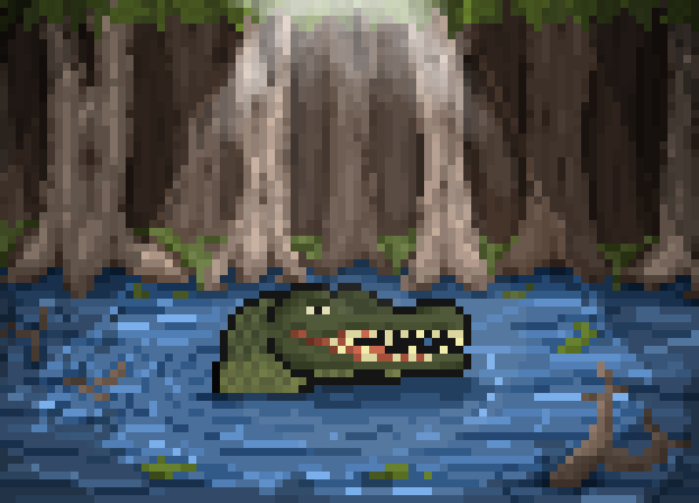
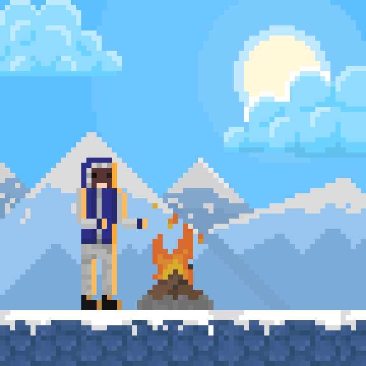

# Portfólio Online — Icaro Dener

###  Sobre Mim
Olha só…✨
“Olá! Sou um artista de pixel art em início de carreira, mas já trago uma experiência legal criando sprites, cenários e experimentando diferentes estilos visuais. Sempre fui apaixonado por esse universo retrô e estou em constante aprendizado para aprimorar minhas técnicas...”.  
Meu estilo é transformar pixels em algo único — focado em detalhes, jogos, assets e ilustrações criativas.

---

###  Acesse o Site
[**Veja o portfólio ao vivo!**](https://icaro-dener.github.io/Portfolio-Online/)

---
###  Galeria de Pixel Art
<table>
  <tr>
    <td></td>
    <td></td>
  </tr>
  <tr>
    <td></td>
    <td></td>
  </tr>
</table>

---

###  Tecnologias & Ferramentas

  
  
  
 -->

---

### ⚙️ Integrações & Funcionalidades

Esse portfólio não é só bonito, também tem umas **funcionalidades bacanas**:

- 📌 **Menu âncora** — navegação suave entre as seções do site.  
- 🌍 **Botão de idioma** — alterna entre português e inglês de forma rápida.  
- 🔍 **Zoom em imagens** — destaque para cada pixel art com efeito de zoom.  
- 🎨 **Galeria organizada** — exibição responsiva dos trabalhos em pixel art.  

---

### 🦇 Easter Egg: O Morcegão
Shhh... 👀  
Existe um **morcego misterioso** nesse projeto.  
Se você clicar nele, ele muda de sprite...  
E quem sabe você consiga até **controlar no WASD**.  
Descubra se é verdade visitando o site! 🦇
